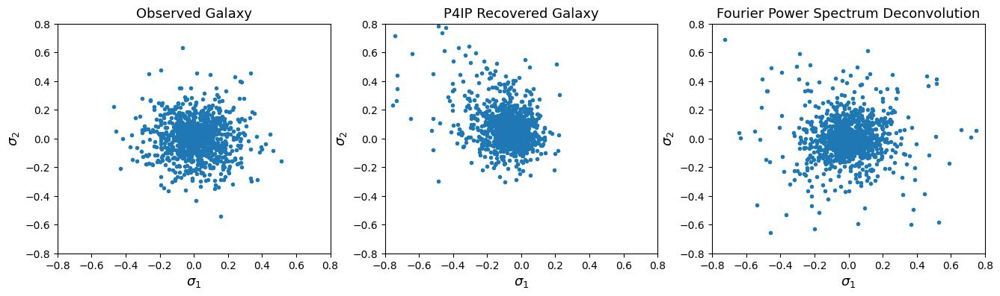

# Work Log

## Week 0 ( - 6.27)

**6.27 Meeting with Emma**
1. Report summary of atmosphere effects.
2. EA TODO: low rank decomposition sources, [Frank Ong's work](https://people.eecs.berkeley.edu/~mlustig/).
3. TL TODO: do deconv comparison (long exposure w/ long exposure PSF, SE with correct SE PSF, incorrect SE PSF, LE PSF), perhaps of a few different deconv methods, THEN EA reach out to Adam Miller.
4. Questions for Adam: relative merit of blind v nonblind (sparsity of calibration stars, processing speed needed), how can papers get away with ignoring atmo PSF [8 am or 5 pm or later].
5. Research plan:
| Week | Plan |
| :--: | :-- |
| July week 1 | test deconvolution algorithms on short vs long exposure images |
| July week 2 | consult astro expert, explore low rank decomposition |
| July weeks 3 & 4 | simulation test of low rank decomposition to determine time, space, rank required for good performance |
| Aug weeks 1 & 2 | continue characterizing low rank non blind deconvolution, explore blind deconvolution |
| Aug weeks 3 & 4 | write up report of summer work |
---

## Week 1 (6.28 - 7.4)

**7.1 - 7.3**
1. ~~Build dataset with Galsim image simulation~~: randon shear for galaxy and PSF, drawImage with typical parameters (LSST).

**7.4**
1. ~~Try Unrolled-PnP-ADMM (poisson deblurring) on dataset~~: train 20 epochs on 100-epoch pretrained model, result:

    PSNR: 23.41 -> 30.01

**7.4 Meeting with Emma**
1. Report image simulation process and results on unrolled ADMM
2. Read **low rank** paper: [MiniScope3D](https://www.nature.com/articles/s41377-020-00403-7.epdf?sharing_token=nK5gCxZK1t5FggfHywi1n9RgN0jAjWel9jnR3ZoTv0NQp7nPZsE-AeCQRwJXW5xP7zCxf5QqwKHkKkkw6wSKpXeaEpZrAsG9aQTUSvla5AoZ3nd9_KDJojiAsEvZrvxXYzvxWbakIjOfIhsFi2hH5HC8kS3XjHjc6oH2SYbPVYE%3D) & [DiffuserCam]
3. Nick Antipa, 7 am China time availability.
4. [Tutorials for unrolled optimization](https://waller-lab.github.io/DiffuserCam/tutorial.html)
5. Finish other deconvolution algorithms on data.
---

## Week 2 (7.5 - 7.11)

**7.6**
1. Adam Miller is happy to meet wirh us next week, any day at 9 am Chicago/10 pm China.

**7.7**
1. ~~Improve dataset~~: add randomness to optical PSF, split data into trianset & testset.
2. Train unrolled ADMM on improved dataset.

**7.8**
1. Low rank galaxy: [paper](https://arxiv.org/abs/1703.02305)
2. Weak Lensing pipeline _ShapePipe_: [paper](https://arxiv.org/abs/2206.14689)
3. Author of the papers above: [Samuel Farrens](https://sfarrens.github.io/about.html), works on PSF deconvolution, weak lensing and image restoration.
---

## Week 3 (7.12 - 7.18)

**7.18 Meeting with Emma**
1. Fixed FPFS bug and plot shear error density distribution.

2. Find more information on PSF interpolation.
3. Find out how much the low-rank method could sppeed up and how many ranks should be kept to maintain performance.
4. look for information on [undergrad pre](https://project.lsst.org/meetings/rubin2022/agenda/undergraduate-student-poster-session-research-related-rubinlsst) at Rubin.
---

## Week 4 (7.19 - 7.25)

**7.21**
1. Wrote demo notebook on image simulation.

**7.22**
